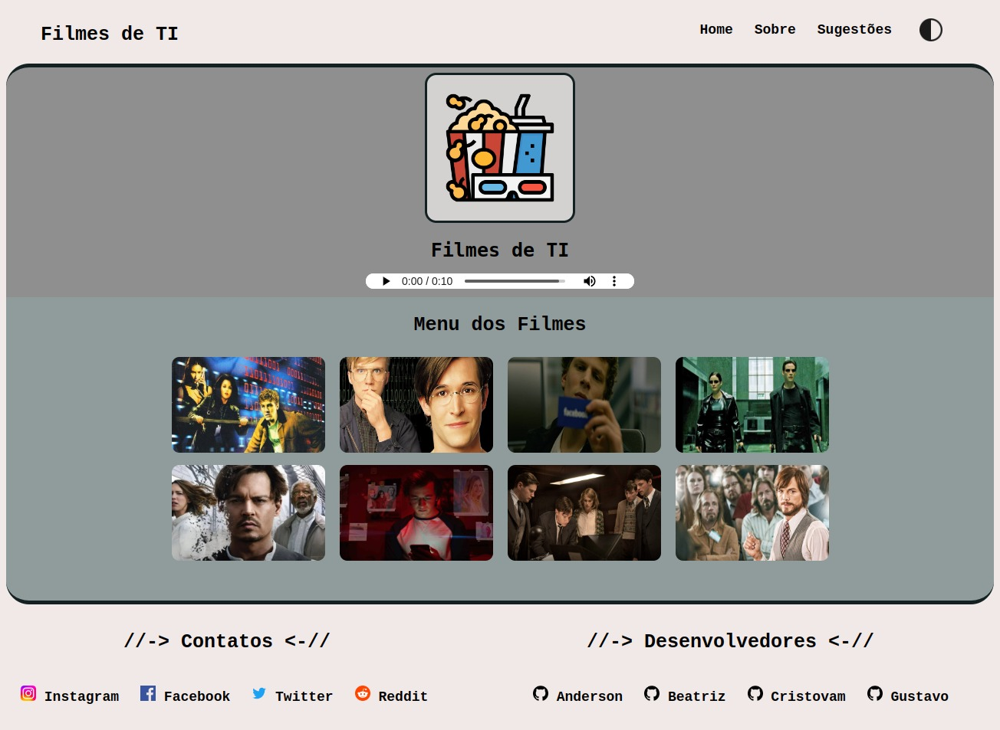
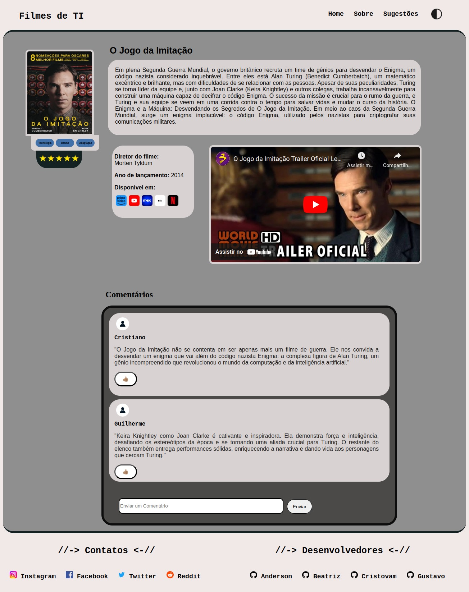
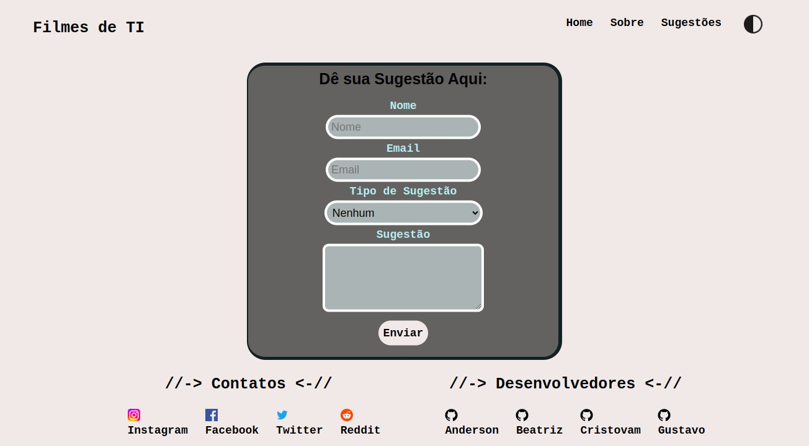
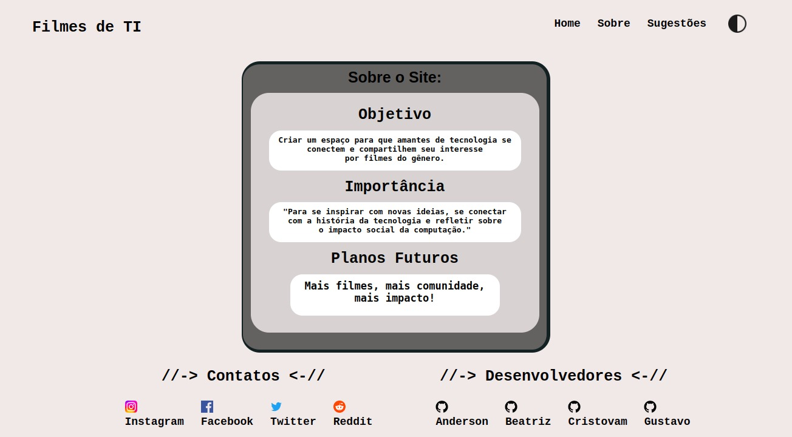

<h1 align="center"> Projeto de um Blog de filmes de TI</h1>

* [Integrantes](#Integrantes)
* [Requisitos](#Requisitos)
* [Tarefas](#Tarefas)
* [Regras de Instruções](#Regras-de-Instruções)
* [Imagens do Site](#Imagens-do-Site)

## Integrantes
   - and3510
   - gustavodovale
   - whosbea
   - cristovam10000

## Requisitos
   - Menu Principal;
   - Uma página para cada filme;
   - Mesmo estilo de cores em todos as páginas;
   - Modo escuro e claro;
   - Pagina de formulário;
   - Audio feito em IA para explicação do site.
   - Notas do filmes por estrelas
   - Avaliação de comentario com like e deslike

## Tarefas
   - Anderson → Fazer o homepage, 2 duas páginas de filme, formulario e sobre o site;
   - Gustavo →  2 duas páginas de filme;
   - Beatriz → 2 duas páginas de filme;
   - Cristovam → 2 duas páginas de filme.

## Regras de Instruções
   - 8 paginas (links âncoras não contam);
   - Navegação entre páginas;
   - 3 imagens;
   - 1 áudio;
   - 1vídeo;
   - Estilização com CSS em tags, Classes e Ids;
   - 1 Formulário;
   - Estruturação do HTML com <header> <section> <footer> etc;
   - Uso de 3 eventos de interação com o usuario com javascript DOM.

## Imagens do Site

   ### Homepage:
   
   -----
   ### Página do Filme:
   
   ------
   ### Página da Sugestão:
   
   ------
   ### Página sobre o Site:
   
